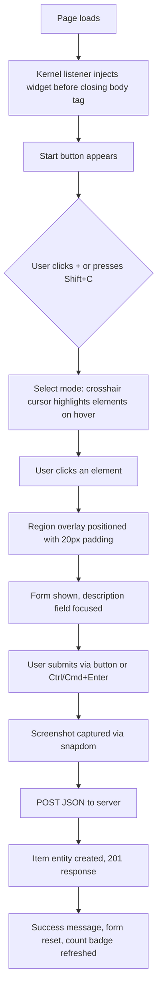

# Tidy feedback

This is a [Drupal module](https://www.drupal.org/docs/user_guide/en/understanding-modules.html) *and* a [Symfony
bundle](https://symfony.com/doc/current/bundles.html) for collecting user feedback.

## Installation

``` shell
composer require itk-dev/tidy-feedback
```

> [!IMPORTANT]
> You may have to add `--with-all-dependencies` to the `composer require` command to make everything fall into place.

### Drupal

``` shell
drush pm:install tidy_feedback
```

### Symfony

Create `config/routes/tidy_feedback.yaml` (or copy
[`resources/config/routes/tidy_feedback.yaml`](resources/config/routes/tidy_feedback.yaml)):

``` yaml
#config/routes/tidy_feedback.yaml
tidy_feedback:
  resource: "@TidyFeedbackBundle/config/routes.php"
  prefix: /tidy-feedback
```

> [!NOTE]
> You can use any path as `prefix`, but for consistency with the Drupal version of Tidy feedback you should use
> `/tidy-feedback`.

If [Symfony Flex](https://symfony.com/doc/current/setup/flex.html) hasn't already done so, you must enable the
TidyFeedbackBundle bundle:

``` php
// config/bundles.php
return [
    …,
    ItkDev\TidyFeedbackBundle\TidyFeedbackBundle::class => ['all' => true],
];
```

## Configuration

We need a [Doctrine database
URL](https://www.doctrine-project.org/projects/doctrine-dbal/en/4.2/reference/configuration.html#connecting-using-a-url)
in the environment variable `TIDY_FEEDBACK_DATABASE_URL`, e.g.

``` dotenv
# .env
# See https://www.doctrine-project.org/projects/doctrine-dbal/en/4.2/reference/configuration.html#connecting-using-a-url for details.
TIDY_FEEDBACK_DATABASE_URL=pdo-sqlite://localhost//app/tidy-feedback.sqlite
```

As an alternative for Drupal you can set `TIDY_FEEDBACK_DATABASE_URL` in `settings.local.php`:

``` php
# web/sites/default/settings.local.php
putenv('TIDY_FEEDBACK_DATABASE_URL=pdo-sqlite://localhost//app/tidy-feedback.sqlite');
```

See [All configuration options](#all-configuration-options) for details and more options.

## Create Tidy feedback database

In a Drupal project, run

``` shell
drush tidy-feedback:doctrine:schema-update

```

In Symfony projects, run

``` shell
bin/console tidy-feedback:doctrine:schema-update
```

After installation and configuration, open `/tidy-feedback/test` on your site and enjoy!

## How the widget works

The feedback widget is automatically injected into every HTML page via a kernel response listener (`onKernelResponse`).
No template changes are needed — the widget HTML is appended before the closing `</body>` tag.

The widget runs inside a [Shadow DOM](https://developer.mozilla.org/en-US/docs/Web/API/Web_components/Using_shadow_DOM),
which isolates its styles from the host page. The user-facing workflow is:

1. A "Feedback" button appears on the right side of the page
2. Clicking it opens a form with a draggable region overlay for highlighting a part of the page
3. The user fills in email and description fields
4. On submit, a screenshot is captured automatically using [snapdom](https://github.com/zumerlab/snapdom)
5. The screenshot, form data, and page context (URL, viewport size, etc.) are sent to the server



## Query string parameters

You can use query string parameters to control the widget:

- `tidy-feedback-show=form` — automatically open the feedback form when the page loads
- `tidy-feedback[email]=...` — pre-fill (and lock) the email field
- `tidy-feedback[description]=...` — pre-fill the description field

Example:

``` plain
/my-page?tidy-feedback-show=form&tidy-feedback[email]=user@example.com
```

## Disabling the widget

The widget can be disabled entirely or on specific pages:

- **`TIDY_FEEDBACK_DISABLE=true`** — disables the widget on all pages
- **`TIDY_FEEDBACK_DISABLE_PATTERN`** — a regex matched against the request path. Pages matching the pattern will not
  show the widget. Default: `@^/tidy-feedback$@` (hides the widget on the feedback list page itself)

Examples:

``` dotenv
# Disable on all admin pages
TIDY_FEEDBACK_DISABLE_PATTERN=@^/(admin|tidy-feedback)@

# Don't disable on any pages (empty pattern never matches)
TIDY_FEEDBACK_DISABLE_PATTERN=@^$@
```

## Viewing feedback

All feedback items are listed at `/tidy-feedback`. Individual items can be viewed at `/tidy-feedback/{id}`, and
screenshots at `/tidy-feedback/{id}/image`.

To get JSON output, append `?_format=json` to any of these URLs.

### Access control

By default, the feedback list and detail pages are publicly accessible. To restrict access with basic authentication,
set `TIDY_FEEDBACK_USERS` to a JSON object mapping usernames to passwords:

``` dotenv
TIDY_FEEDBACK_USERS={"admin": "s3cret", "reviewer": "p4ssw0rd"}
```

## API endpoints

All paths are relative to the Tidy feedback prefix (default `/tidy-feedback`).

| Method | Path | Description | Auth required | Response |
|--------|------|-------------|---------------|----------|
| `GET` | `/` | List all feedback items | Yes (if users configured) | HTML or JSON |
| `POST` | `/` | Create a new feedback item | No | JSON (201) |
| `GET` | `/check` | Get feedback count for a URL | No | JSON |
| `GET` | `/{id}` | Show a single feedback item | Yes (if users configured) | HTML or JSON |
| `GET` | `/{id}/image` | Get the screenshot image | Yes (if users configured) | Binary image |
| `GET` | `/asset/{asset}` | Serve a compiled asset | No | Binary file |

Append `?_format=json` to `GET /` or `GET /{id}` to force JSON output.

### POST /

Create a new feedback item by sending a JSON body:

| Field | Type | Description |
|-------|------|-------------|
| `created_by` | `string` (optional) | Email address of the submitter |
| `email` | `string` (optional) | Email address (stored in data) |
| `description` | `string` | Feedback description |
| `image` | `string` | Screenshot as a data URI |
| `context` | `object` | Page context (URL, viewport, selected element, etc.) |

Example 201 response:

``` json
{
  "data": {
    "id": 42,
    "createdAt": "2025-07-10T12:00:00+00:00",
    "createdBy": "user@example.com",
    "data": { "..." }
  }
}
```

### GET /check

Returns the feedback count and a summary of items for a given URL.

| Parameter | Type | Description |
|-----------|------|-------------|
| `url` | `string` (query) | The page URL to check |

Example response:

``` json
{
  "data": {
    "count": 3,
    "items": [
      {
        "description": "Button is misaligned",
        "url": "/tidy-feedback/42",
        "selectedElement": "div.main > button.submit"
      }
    ]
  }
}
```

### Data schema

The `data` JSON column on each Item entity stores the full feedback payload:

``` json
{
  "email": "user@example.com",
  "description": "The heading overlaps the sidebar",
  "image": "data:image/svg+xml,...",
  "context": {
    "url": "https://example.com/page",
    "viewport": { "width": 1920, "height": 1080 },
    "selectedElement": "div.content > h1",
    "region": { "top": 100, "left": 50, "width": 400, "height": 200 }
  },
  "created_by": "user@example.com"
}
```

## All configuration options

Only `TIDY_FEEDBACK_DATABASE_URL` is required.

| Name                            | Default value        | Example                                            |
|---------------------------------|----------------------|----------------------------------------------------|
| `TIDY_FEEDBACK_CACHE_DIR`       |                      | `/tmp/tidy-feedback`                               |
| `TIDY_FEEDBACK_DATABASE_URL`    |                      | `pdo-sqlite://localhost//app/tidy-feedback.sqlite` |
| `TIDY_FEEDBACK_DEBUG`           | `false`              |                                                    |
| `TIDY_FEEDBACK_DEFAULT_LOCALE`  | `da`                 |                                                    |
| `TIDY_FEEDBACK_DEV_MODE`        | `false`              |                                                    |
| `TIDY_FEEDBACK_DISABLE`         | `false`              |                                                    |
| `TIDY_FEEDBACK_DISABLE_PATTERN` | `@^/tidy-feedback$@` | `@^$@` (don't disable on all pages)                |
| `TIDY_FEEDBACK_USERS`           | `{}`                 | `{"admin": "password"}`                            |

Boolean options must be set to `true`, e.g. `TIDY_FEEDBACK_DISABLE=true`, to be true. Otherwise they're false.

The pattern in `TIDY_FEEDBACK_DISABLE_PATTERN` will be matched against the *path* of the request URL only, i.e. the
query string will *not* be included.

## Development

``` shell
task
```

### Architecture

Tidy feedback is designed to work as both a Drupal module and a Symfony bundle from a single codebase. The key design
patterns are:

- **Shared trait**: The controller logic lives in `TidyFeedbackControllerTrait` (`src/Controller/`). Both the Drupal and
  Symfony controllers consume this trait, avoiding code duplication.
- **Separate entity manager**: The module creates its own Doctrine `EntityManager` configured via
  `TIDY_FEEDBACK_DATABASE_URL`, keeping feedback data isolated from the host application's database.
- **Kernel listener**: `TidyFeedbackHelper` implements `EventSubscriberInterface` and listens on `kernel.response` to
  inject the widget HTML before the closing `</body>` tag.
- **Shadow DOM isolation**: The widget renders inside a Shadow DOM so its styles never leak into (or are affected by)
  the host page.
- **Watered-down Twig**: The helper instantiates a minimal Twig environment with only a `trans` filter and a `path`
  function, independent of the host framework's template engine.

### composer.json

In order to make this behave as both a Drupal module and a Synfony bundle, we use some tricks in
[`composer.json`](./composer.json):

``` javascript annotate
{
    // We use "type": "drupal-module" to make Drupal move the module into the
    // proper location (web/modules/contrib).
    // Symfony recommend using "type": "drupal-module" (cf. https://symfony.com/doc/current/bundles/best_practices.html#installation),
    // but Symfony and Flex don't seem to really care about this.
    "type": "drupal-module",
    "require": {
        // In order to not pull much of Symfony into a Drupal project or (worse)
        // much of Drupal into a Symfony project, we require only the bare
        // minimum to make this module/bundle work.
        "doctrine/dbal": "^3 || ^4",
        "doctrine/orm": "^2.8 || ^3",
        // These are required by Drupal 9 later
        "symfony/cache": "^6 || ^7",
        "symfony/http-foundation": "^6 || ^7",
        "symfony/http-kernel": "^6 || ^7",
        "symfony/mime": "^6 || ^7",
        "symfony/routing": "^6 || ^7",
        "twig/twig": "^3"
    },
    "autoload": {
        "psr-4": {
            // The Symfony bundle namespace.
            "ItkDev\\TidyFeedbackBundle\\": "symfony/src/",
            // The shared code namespace.
            "ItkDev\\TidyFeedback\\": "src/"
        }
    },
    // …
}
```

### Twig

We use a watered-down instance of Twig with only a `trans` filter and a `path` function.

### Development app

For development, you can start a Symfony app with Tidy feedback installed:

``` shell
task app:start
```

Run `task app:stop` to stop the app.

See [Query string parameters](#query-string-parameters) for how to auto-open the form and pre-fill fields during
testing.

For easy testing, you can use [Bookmarklet Creator](https://mrcoles.com/bookmarklet/) to convert the code

``` javascript
const url = new URL(document.location);
url.searchParams.set('tidy-feedback-show', 'form');
url.searchParams.set('tidy-feedback[email]', 'test@example.com');
url.searchParams.set('tidy-feedback[description]', 'This is cool!');
document.location = url
```

into a bookmarklet.
